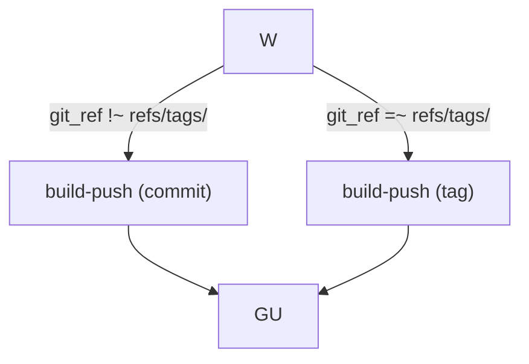

# Pipeline Diagrams

Generate workflow and pipeline diagrams using **Mermaid.js in HTML**, rendered to **PNG via Playwright**. Best suited for CI/CD pipelines, deployment lifecycles, and multi-phase workflows with human actions.

## When to Use This Skill (vs others)

**Use this for:**
- CI/CD pipelines (build → test → deploy → promote)
- Deployment lifecycles (setup → sandbox → production)
- Multi-phase workflows with human actions + automation steps
- DAG-style flowcharts showing triggers, conditions, and branching
- Any diagram where the subject is a **process or workflow** with a temporal dimension

**Use `architecture-diagram` for:**
- Static system topology (components, services, databases, infrastructure layers)
- Cloud architecture, network diagrams, deployment topology

**Use `excalidraw` for:**
- Hand-drawn whiteboard-style diagrams
- Quick brainstorming sketches
- Diagrams that will be imported into excalidraw.com for editing

## Core Workflow

1. **Research the subject** — fetch source of truth (README, docs, manifests, workflow YAMLs) from the repository before drawing anything. The diagram must match reality.
2. **Draft the Mermaid `graph TB` (top-to-bottom)** — organize into `subgraph` blocks for each phase/cluster/environment
3. **Assign semantic colors** — human actions, automation steps, environments, tools each get their own color family
4. **Save as `.html`** — embed Mermaid via CDN, use `mermaid.initialize()` with `theme: 'dark'`
5. **Render via Playwright** — `npx playwright screenshot input.html output.png --viewport-size W,H`
6. **Verify** — check the PNG for correct layout and readability

### Output Location

Save diagrams to a user-specified path, or default to the current working directory:
```
./[project]-[phase]-pipeline-vN.png
```

### Preview

After generating, offer the PNG to the user (send via Telegram with `MEDIA:` prefix).

## SVG-Based Fallback (When Mermaid Fails)

**Use raw SVG instead of Mermaid when:**
- The diagram has emoji, special characters, or complex layout that causes Mermaid parse errors
- Multiple sequential blocks need precise positioning (no overlap when splitting/adding sections)
- The user prefers the dark-themed block-based aesthetic over Mermaid rendering
- Cross-block layout needs manual control (curved paths, precise arrow routing)

### SVG Layout Pattern — Sequential Multi-Stage Blocks

When the diagram has numbered sequential stages (e.g., Setup → Sandbox → Production), use this structure:

1. **Plan Y positions BEFORE writing** — calculate each block's top, height, and bottom. Ensure blocks don't overlap and follow arrows connect correctly.
2. **Each stage is a distinct `<rect>` container** with a title, colored border, and internal step blocks.
3. **Number stages explicitly** — "1. PROJECT CREATION", "2. SANDBOX DEPLOYMENT", etc.
4. **Use color-coded borders** — green for setup/setup templates, blue for sandbox/dev, purple for production.
5. **Connect stages with dashed arrows** — `stroke-dasharray="6,3"` with `marker-end` between stages.
6. **Update all downstream elements** — when splitting or adding a block, shift everything below it down.

### SVG Color Coding Pattern

| Stage | Border Color | Fill Pattern |
|---|---|---|
| Setup / Project Creation | `#34d399` (emerald) | `url(#setupBg)` — green-tinted |
| Sandbox / Dev / CI | `#3b82f6` (blue) | `url(#sandboxBg)` — blue-tinted |
| Production / Promotion | `#8b5cf6` (purple) | `url(#prodBg)` — purple-tinted |
| Infrastructure | `#10b981` (teal) | `url(#infraBg)` — teal-tinted |

### SVG Layout Calculation Checklist

- Calculate: `block_bottom = block_top + block_height`
- Gap between blocks: minimum 20px (`block_next_top = block_prev_bottom + 20`)
- SVG viewBox height must accommodate the **last element's bottom + footer padding** (~30px)
- After adding a new block at the top, **shift ALL subsequent blocks down** by the new block's height + gap
- Update the SVG `viewBox` and `height` attributes to match the new total

### SVG Diagram Design Patterns

See `references/svg-diagram-patterns.md` for SVG-specific rendering tips, arrow patterns, and layout examples.

## Mermaid Diagram Design Patterns

### Phase/Subgraph Layout

Use `subgraph` blocks to group related components. Each subgraph represents a phase, environment, or logical cluster.

**CRITICAL**: Do NOT use `direction TB` inside subgraphs — this causes mermaid v10 syntax errors. Use `graph TB` at the top level for overall layout direction.

**CRITICAL**: Do NOT use `@` inside node labels — this is a reserved character in mermaid and causes parse errors. Use `<b>` for bold/roles, `&nbsp;` for indentation, and plain text for descriptions.

### Multi-Path Branching

Use `when` conditions (as in Argo Workflows) for conditional branching:



### Human Actions vs Automation

Prefix human actions with **Role Name** in `<b>` tags, style them differently (orange/dark-orange). Automation steps use blue/gray:

```mermaid
H["<b>👑 Project Admin</b><br/>1. Run setup-template<br/>&nbsp;&nbsp;Bootstrap project"]
A["⚙️ Automation<br/>technical step"]
style H fill:#7c2d12,stroke:#f97316,stroke-width:2px,color:#fff
style A fill:#1e3a5f,stroke:#3b82f6,stroke-width:1px,color:#fff
```

### Cross-Phase Arrows

Use dashed lines with descriptive labels for cross-phase transitions:

```mermaid
SB -.->|Production-ready image| PA1
style SB fill:#3f2f00,stroke:#f59e0b,color:#fff
style PA1 fill:#7c2d12,stroke:#f97316,stroke-width:2px,color:#fff
```

### Dashed Connections

Use `-.->` for non-blocking or implied connections:

```mermaid
BP -.-> GU
```

### Emoji Usage

Emoji are **problematic** in mermaid v10 — they may or may not render depending on the mermaid version and Playwright's embedded engine. If the diagram renders with errors, **remove all emoji from node labels** and rely on color semantics instead.

Safe emoji (may render in some versions):
- `⚙️` `🔧` `📨` `📤` `📝` `🔄` `📦`

Risky emoji (may cause syntax errors):
- `@` (reserved character — NEVER use in labels)
- Any emoji with zero-width joiner sequences (👩‍💻 uses `\u200d`)
- Any emoji inside multi-line labels with `<br/>`

When in doubt, use plain text with role names like "Project Admin", "Developer" and rely on color coding to distinguish human vs automated steps.

## Color Palette (Semantic)

| Role / Environment | Fill | Stroke |
|---|---|---|
| **Human Action** | `#7c2d12` (dark orange) | `#f97316` (orange) |
| **Automation Step** | `#155e8a` (blue) | `#3b82f6` (blue) |
| **Environment / Phase** | `#1a1a2e` (dark) | `#30363d` (gray) |
| **Sandbox / Dev** | `#3f2f00` (amber) | `#f59e0b` (amber) |
| **Production** | `#1f3a1f` (green) | `#22c55e` (green) |
| **GitOps / Repo** | `#3b1f5e` (purple) | `#8b5cf6` (purple) |
| **Cloud / Build** | `#16322c` (teal) | `#10b981` (teal) |
| **Tool / Service** | `#1e3a5f` (blue) | `#3b82f6` (blue) |
| **Critical Path** | `#7c2d12` | `#f97316` |

## Technical Implementation

### HTML Template Structure

```html
<!DOCTYPE html>
<html>
<head>
<meta charset="utf-8">
<script src="https://cdn.jsdelivr.net/npm/mermaid@10/dist/mermaid.min.js"></script>
<script>mermaid.initialize({startOnLoad:true, theme:'dark', flowchart:{useMaxWidth:true, htmlLabels:true}})</script>
<style>
body { margin: 0; padding: 24px; background: #0d1117; font-family: 'Segoe UI', monospace; }
h1 { color: #c9d1d9; text-align: center; font-size: 18px; margin: 0 0 4px 0; }
.sub { color: #6e7681; text-align: center; font-size: 13px; margin-bottom: 16px; }
.mermaid { display: flex; justify-content: center; }
</style>
</head>
<body>
<h1>[Diagram Title]</h1>
<div class="sub">[Subtitle / Context]</div>
<div class="mermaid">
[Mermaid graph definition]
</div>
</body>
</html>
```

### Playwright Rendering

```bash
npx playwright screenshot input.html output.png --viewport-size 1600,1200
```

For wide diagrams: `--viewport-size 1800,1000`
For tall diagrams: `--viewport-size 1200,1600`

### Rendering Pitfalls

- **`@` in labels is a hard syntax error** in mermaid v10 — never use `@` in node labels. Use `<b>Role Name</b>` instead.
- **`subgraph` + `direction TB`** — mermaid v10 sometimes rejects `direction TB` inside subgraphs. Prefer `graph TB` at top level only.
- **Emoji in multi-line labels** — emoji with zero-width joiners (👩‍💻) or emoji mixed with `<br/>` cause parse errors in mermaid v10. Strategy: try with emoji first; if errors occur, strip all emoji and rely on color semantics.
- **`linkStyle` indices** — the numeric index must match the exact line number of the connection in the diagram. Mismatched indices cause cascade errors. Safer to omit `linkStyle` unless needed.
- **`<` in labels** — use `&lt;` in HTML for literal less-than signs.
- **`-.->` syntax** — dash-dot arrow uses no spaces: `-.->` not `-. -` or `-.  ->`.
- **Viewport size** — match the diagram's width/height. Wide diagrams need larger viewport (1800+ width). Too small = cramped labels.
- **Playwright rendering** — if the HTML opens fine in a browser but Playwright screenshot is blank, it's likely a CDN/network issue in the headless context.

## Research Before Drawing

**CRITICAL**: Never draw a pipeline diagram from memory or assumptions. Always fetch the source of truth first:

1. **README.md** — get the high-level flow
2. **Workflow YAML files** — check `when` conditions, `templates`, `steps` ordering
3. **Architecture docs** — understand environments (sandbox vs production), promotion flow
4. **CI/CD Philosophy docs** — understand "build once, promote anywhere" model

Example fetch pattern:
```bash
# README
curl -sL "https://raw.githubusercontent.com/ORG/REPO/BRANCH/README.md" | head -100

# Workflow template
curl -sL "https://raw.githubusercontent.com/ORG/REPO/BRANCH/manifests/workflows/TEMPLATE.yaml"

# Concept docs
curl -sL "https://raw.githubusercontent.com/ORG/REPO/BRANCH/docs/concepts/CATEGORY.md"
```

## Output Requirements

- **HTML**: One self-contained `.html` file with inline Mermaid (via CDN)
- **PNG**: Rendered snapshot via Playwright, named `NAME.png`
- **Send to user**: Use `MEDIA:` prefix for Telegram delivery
- **Version increment**: Each user correction gets a new version (v1, v2, v3...) — don't overwrite the same file without incrementing

## Three-Phase Structure (Project Creation → Sandbox → Production)

When the user specifies a "1. Project Creation, 2. Sandbox Bootstrap, 3. Production" structure, follow this EXACTLY:

1. **PROJECT CREATION** (green block) — ONLY `luban-project-setup-template`. Creates infrastructure on BOTH Admin and Worker clusters. Do NOT include Dagster platform or code-location here.
   - Admin Cluster resources: ci-{project} namespace, ArgoCD AppProjects (snd+prd), Harbor project, git repo, RBAC
   - Worker Cluster resources: snd-{project} + prd-{project} namespaces, RBAC, cluster_map config
2. **SANDBOX BOOTSTRAP** (blue block) — `luban-dagster-platform-setup-template` + `luban-dagster-dbt-starrocks-code-location-setup-template` targeting `snd`. Creates Dagster workloads.
3. **SANDBOX DEVELOPMENT + CI** (blue block) — Developer → Jupyter Hub → git push → kpack → git-update → ArgoCD auto sync → sandbox
4. **PRODUCTION BOOTSTRAP** (purple block) — Same two bootstrap templates targeting `prd`
5. **PRODUCTION PROMOTION** — `promotion-workflow` extracts verified sandbox image
6. **PRODUCTION DEPLOYMENT** — Manual ArgoCD sync in order: infra → platform → code-location

### User Preference: Project Creation Must Be Standalone

The user has explicitly requested that Project Creation be a SEPARATE block from Sandbox/Production Bootstrap. This is because `luban-project-setup-template` creates namespace/RBAC/Harbor infrastructure that is a PREREQUISITE for the bootstrap templates. Never merge Project Creation into the Sandbox Bootstrap block.

### User Preference: Production Also Has Bootstrap

Production is NOT just Promotion + Deployment. It also has a Bootstrap phase where Project Admin runs the same setup templates targeting `prd`. The diagram should show this explicitly.

### Diagram Layout Pattern

Layout sequential blocks (numbered 1, 2, 3...) vertically on the left side. Developer CI pipeline can be on the right side as a parallel block. Production block below Sandbox. Connect Sandbox → Production with a dashed arrow labeled "verified image".

### Production Deployment Order (IMPORTANT)

Production deployment is **manual ordered ArgoCD sync**, NOT auto-detected:
1. Sync infra pipeline first
2. Sync dagster-platform pipeline second
3. Sync code-location pipeline third

This ordering matters because code-location depends on platform depending on infra.

### User Preference: Follow Step Descriptions Exactly

When the user provides numbered step descriptions for diagram structure, **follow them precisely** — do not merge, reorder, or add steps not explicitly mentioned. The user's step numbers and groupings ARE the diagram structure. If the user says "Sandbox 1. Bootstrap 2. Developer 3. Deployment", those are three distinct numbered blocks in the SVG, not sections inside one block.

### User Preference: Separate Project Creation from Bootstrap

When the user distinguishes "Project Creation" (step 1) from "Bootstrap" (step 2+), treat them as **separate blocks**. Project Creation (`luban-project-setup-template`) creates namespace/RBAC/Harbor infrastructure. Bootstrap (`luban-dagster-platform-setup-template` + `luban-dagster-dbt-starrocks-code-location-setup-template`) deploys actual applications to the sandbox. Each is a distinct block in the SVG — do NOT merge them into one "Setup" block.

### Project Creation: Admin vs Worker Cluster Resources

`luban-project-setup-template` creates resources on both clusters. When diagramming it, split resources into two columns:
- **Admin Cluster**: ci-{project} namespace, ArgoCD AppProjects (snd + prd), Harbor project, git repo(s), RBAC
- **Worker Cluster**: snd-{project} + prd-{project} namespaces, RBAC, cluster_map configuration

## Related Files

- See `references/argo-workflow-conditions.md` for common Argo Workflows `when` condition patterns used in pipeline diagrams.
- See `references/luban-ci-workflow-patterns.md` for Luban CI-specific workflow structure, setup sequences, and parameter reference.
- See `references/svg-diagram-patterns.md` for SVG-based diagram patterns (arrows, gradients, text styles, layout checklist) — use when Mermaid fails or raw SVG is preferred.